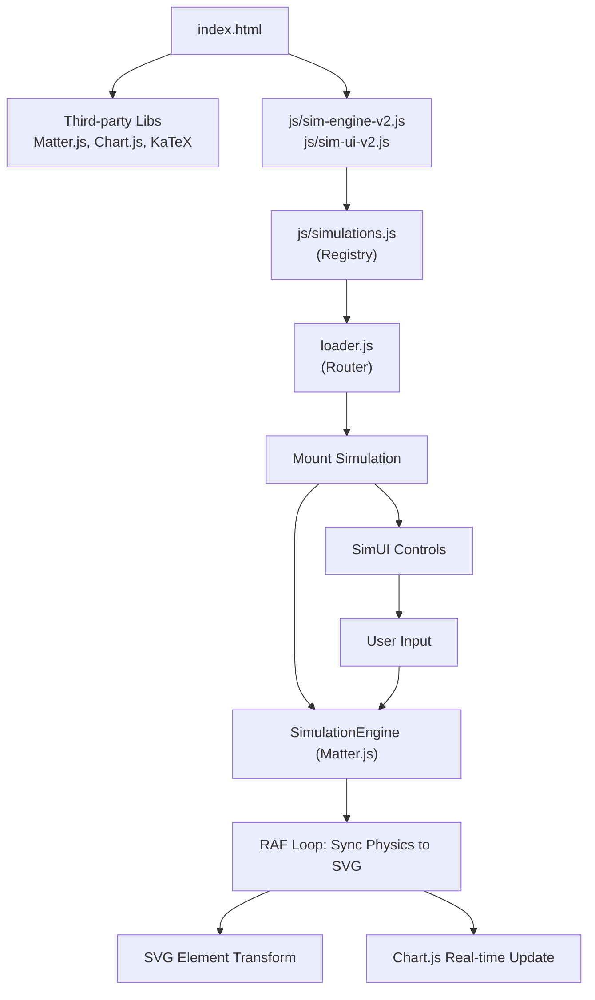

# System Architecture

## Simulation V2 — Architecture Update (2026-05-10)

Hệ thống simulation đã được tái cấu trúc toàn diện (V2) để chuyển từ engine tự phát triển sang mô hình **Headless Matter.js + SVG/DOM Sync**:

- **Core Engine (V2)**: `js/sim-engine-v2.js` sử dụng **Matter.js** để xử lý vật lý (rigid body, constraints, collisions). Engine này chạy "headless" (không dùng canvas renderer mặc định của Matter.js).
- **SVG/DOM Rendering**: Trạng thái từ Matter.js (position, angle) được đồng bộ trực tiếp sang các thuộc tính `transform` của các phần tử SVG hoặc DOM. Điều này cho phép tận dụng sức mạnh của CSS cho styling và cải thiện khả năng truy cập (accessibility).
- **Standardized UI**: `js/sim-ui-v2.js` cung cấp các component điều khiển (sliders, buttons) chuẩn hóa và tích hợp **Chart.js** để vẽ đồ thị theo thời gian thực một cách hiệu quả.
- **Unified Registry**: `js/simulations.js` quản lý việc đăng ký và khởi tạo các route simulation dựa trên engine V2.

## Tổng quan runtime

| Thành phần | Trách nhiệm |
|---|---|
| `index.html` | Nạp: foundation layers (Matter.js, Chart.js) → core V2 logic → simulation registry |
| **Physics Engine** (`Matter.js`) | Tính toán chuyển động, va chạm và ràng buộc vật lý. |
| **SimEngine V2** (`js/sim-engine-v2.js`) | Quản lý vòng lặp RAF, cập nhật Matter.js engine và đồng bộ tọa độ sang SVG/DOM. |
| **SimUI V2** (`js/sim-ui-v2.js`) | Tạo controls (sliders/buttons) và quản lý real-time charts qua Chart.js. |
| **Simulation Registry** (`js/simulations.js`) | Đăng ký các route simulation và cấu hình scene cụ thể. |
| `loader.js` | Resolve route và mount/unmount simulation tương ứng vào trang. |
| `js/deprecated/` | Chứa các file simulation cũ (custom engine) để tham khảo hoặc tương thích ngược. |
| `tools/*.py` | DOCX sync, audit, QA gates. |

## Luồng tải và thực thi

1. Browser mở `index.html`, nạp các thư viện bên thứ ba (Matter.js, Chart.js, KaTeX).
2. `js/sim-engine-v2.js` và `js/sim-ui-v2.js` được nạp để sẵn sàng khởi tạo.
3. `loader.js` xác định route hiện tại. Nếu trang có simulation:
   - Khởi tạo `SimulationEngine` v2.
   - Thiết lập scene (thêm các vật thể Matter.js và liên kết với SVG elements).
   - Khởi tạo `SimUI` để tạo bảng điều khiển.
   - Bắt đầu vòng lặp simulation qua `engine.start()`.
4. Trong mỗi frame (RAF):
   - Matter.js cập nhật trạng thái vật lý.
   - `SimulationEngine` duyệt qua danh sách các vật thể, tính toán transform (có tính đến `flipY` và `originOffset`) và cập nhật thuộc tính `transform` của SVG element.
   - `SimChart` (nếu có) cập nhật dữ liệu mới lên đồ thị.
5. Khi người dùng chuyển trang: `loader.js` gọi lệnh stop simulation để giải phóng tài nguyên.

## New Architecture — Matter.js Sync Design

```
[ User Interaction ] 
      ↓
[ SimUI (Sliders/Buttons) ] → [ Matter.js Body Properties ]
      ↓
[ Matter.js Engine (Physics Loop) ]
      ↓ (State Sync)
[ SimulationEngine V2 ]
      ↓ (Coordinate Transform: flipY, origin)
[ SVG / DOM Elements (Transform Attribute) ]
      ↓
[ Browser Rendering ]
```

### Đồ thị (SimChart)
Sử dụng **Chart.js** với cấu hình tối ưu (disable animation, shift data) để hiển thị các thông số cơ học (vận tốc, gia tốc, năng lượng) mà không làm giảm hiệu năng simulation.

## Diagram



## Backward Compatibility

- Các file simulation cũ dựa trên custom physics engine đã được di chuyển vào `js/deprecated/`.
- `js/simulations.js` vẫn giữ API tương thích để `loader.js` có thể gọi mà không cần thay đổi logic routing chính.
- Toàn bộ 58 routes được đảm bảo hoạt động ổn định trên nền tảng V2 mới.

## Persistence layer
(Giữ nguyên như cũ)


| Key | Module | Nội dung |
|---|---|---|
| `theme` | `app.js` | Sáng/tối |
| `fontZoom` | `app.js` | Mức zoom chữ |
| `readPages` | `app.js` | Timestamp trang đã đọc |
| `quizScores` | `quiz.js` | Score quiz theo stateKey |
| `chlyt_progress` | `progress.js` | Visit/read state theo page |
| `chlyt_bookmarks` | `progress.js` | Danh sách bookmark |
| `chlyt_notes` | `notes.js` | Highlight và note cá nhân |
| `chlyt_activity_progress_v1` | `sim-activities.js` | Step completion và score gần nhất cho simulation checker |

## Ghi chú

- Tất cả 58 P1 routes hiện đăng ký qua `js/sims/ch*/...-routes.js` và mount bằng shared professional lab.
- `js/routes/chapter-*.js` vẫn được load để giữ compatibility, nhưng không còn là source ưu tiên khi canonical registry route tồn tại.
- Canonical routes dùng renderer registry + behavior registry + scene registry; missing renderer hiện diagnostic canvas thay vì family dispatch.
- Renderer-contract và browser QA route discovery chỉ đếm canonical P1 routes; compatibility routes vẫn còn để fallback/runtime load nhưng không tham gia canonical coverage.
- Canvas: 760×440 logical pixels, tự scale theo container width.
- Colors: `--bg: #091a33` (dark navy), `--gold: #c9963a`.
