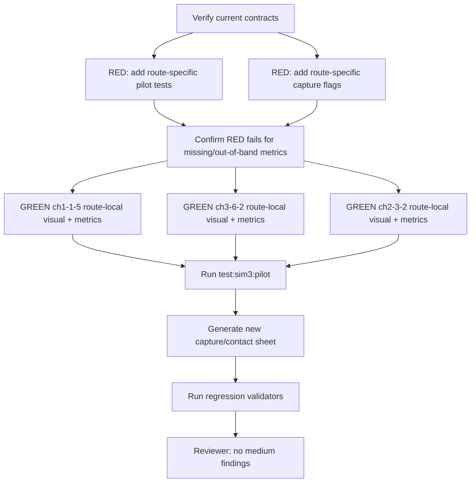

# Sim3 third-pass visual polish deep TDD

## Recommendation

Create this new plan at `plans/260606-sim3-third-visual-polish-deep-tdd/plan.md` and treat the earlier concise plan `plans/260606-sim3-third-visual-polish-tdd/plan.md` as superseded. Reason: parent asked for `/ck:plan --deep --tdd` equivalent; new path preserves prior attempt for audit and avoids mixing concise vs deep acceptance gates.

## Codebase context verified

- Repo is static HTML/CSS/JS; runtime is offline, no bundler requirement. README says Sim3 uses vendored Three.js at `lib/three/three.umd.min.js` and remains optional fallback over Sim2, with adapters under `js/sim3/sims/` and core under `js/sim3/core/`.
- Dev-only scripts include `test:sim3:pilot`, `test:sim3:visual:capture`, `test:sim:visual:unit`, `test:sim:physics`, and `test:sim:mount` in `package.json:6-18`.
- Sim3 route adapters are loaded by fixtures:
  - `tests/fixtures/sim2-ch1.html:29-34` loads Sim3 core and `js/sim3/sims/ch1-1-5-3d.js`.
  - `tests/fixtures/sim2-ch2.html:28-35` loads Sim3 core and `js/sim3/sims/ch2-3-2-3d.js`.
  - `tests/fixtures/sim2-ch3.html:28-35` loads Sim3 core and `js/sim3/sims/ch3-6-2-3d.js`.
- Sim2-to-Sim3 attach contracts:
  - `js/sim2/sims/ch1/ch1-1-5.js:70-73` attaches `root.Sim3Ch115.create(...)`.
  - `js/sim2/sims/ch2/ch2-3-2.js:111-114` attaches `root.Sim3Ch232.create(...)`.
  - `js/sim2/sims/ch3/ch3-6-2.js:128-131` attaches `root.Sim3Ch362.create(...)`.
- Shell contracts currently available without core change:
  - `js/sim3/core/three-shell.js:73` exposes `labels.add/remove/update/countVisible`, `projectMargin`, `projectBounds`, `projectDistance`, `setState`, `render`, `resize`, and `dispose`.
  - `js/sim3/core/three-shell.js:106-134` implements projection metrics used by current visual gates.
  - `js/sim3/core/three-shell.js:146-180` owns DOM label creation/removal.
- Current pilot test helper reads `window.__SIM3_DEBUG__[route].visualMetrics` and generic metrics at `tests/sim3-pilot-fallback-dispose.spec.js:57-75`.
- Current contact-sheet capture writes `capture-manifest.json` and `contact-sheet.html` at `tools/sim3-visual/pilot-capture.spec.js:31-35`; target routes are set at `tools/sim3-visual/pilot-capture.spec.js:10`; target flags are generic at `tools/sim3-visual/pilot-capture.spec.js:91-98`.
- `docs/development-rules.md` was not present in repo search; follow README + package scripts + existing test style.

## Exact requirements

### Scope

All three target routes have equal priority and must be improved/tested/captured:

1. `ch1-1-5`
2. `ch3-6-2`
3. `ch2-3-2`

### Acceptance

- Images visibly better on all three target routes.
- All new and existing metrics pass.
- `ch1-1-5`: resultant `R` not too large/decorative.
- `ch3-6-2`: ghost/live states clearer.
- `ch2-3-2`: `Đai` label semantically targets belt span, not gear/pulley face.
- New contact sheet generated.
- Reviewer reports no medium-or-higher findings.

### Constraints

- No physics changes.
- No dependency changes.
- No implementation in this planning phase.
- Prefer route-local adapter edits; `js/sim3/core/three-shell.js` only if unavoidable and proven by RED tests.

## Touchpoints and contracts

| File | Ownership | Contract | Allowed changes |
|---|---|---|---|
| `tests/sim3-pilot-fallback-dispose.spec.js` | RED tests | Reads DOM labels and `window.__SIM3_DEBUG__[route].visualMetrics`; current helper at `tests/sim3-pilot-fallback-dispose.spec.js:57-75` | Add route-specific failing assertions and reusable helper branches only |
| `tools/sim3-visual/pilot-capture.spec.js` | Capture/reporting | Emits screenshots + manifest/contact sheet at `tools/sim3-visual/pilot-capture.spec.js:31-35`; target flags at `tools/sim3-visual/pilot-capture.spec.js:91-98` | Add route-specific flags/metric notes for target rows |
| `js/sim3/sims/ch1-1-5-3d.js` | GREEN route owner | Consumes Sim2 `forces`/`resultant`, exports `root.Sim3Ch115` at `js/sim3/sims/ch1-1-5-3d.js:130` | Visual scale/placement/labels/debug metrics only |
| `js/sim3/sims/ch3-6-2-3d.js` | GREEN route owner | Consumes Sim2 collision state, exports `root.Sim3Ch362` at `js/sim3/sims/ch3-6-2-3d.js:182` | Ghost/live placement/material opacity/labels/debug metrics only |
| `js/sim3/sims/ch2-3-2-3d.js` | GREEN route owner | Consumes Sim2 transmission state, exports `root.Sim3Ch232` at `js/sim3/sims/ch2-3-2-3d.js:203` | Belt label target/metric geometry/debug metrics only |
| `js/sim3/core/three-shell.js` | Avoid | Shared shell/projection/label layer | Touch only if route-local metrics cannot compute DOM-free semantic checks |

## Dependency graph



Blockers:

- GREEN cannot start before RED assertions define concrete metric names and thresholds.
- Capture acceptance cannot close before `SIM3_VISUAL_OUT_DIR` run emits fresh target screenshots, manifest, and contact sheet.
- Reviewer gate cannot start before validators pass, otherwise findings mix implementation bugs with test breakage.

## Data flow

### Runtime route flow

1. Fixture or app mounts Sim2 route through `window.SIM_MAP[route](host)`; test helper does this at `tests/sim3-pilot-fallback-dispose.spec.js:7-10`.
2. Sim2 route creates normal 2D simulation and conditionally attaches Sim3 mode:
   - ch1 passes `{ forces, resultant }` to Sim3 at `js/sim2/sims/ch1/ch1-1-5.js:56-60`.
   - ch2 passes `{ r1, r2, omega1, gearOmega2, beltOmega2, gearPhi1, gearPhi2, beltPhi2 }` at `js/sim2/sims/ch2/ch2-3-2.js:94-98`.
   - ch3 passes collision state through `root.Sim3Ch362.create(...)` attachment at `js/sim2/sims/ch3/ch3-6-2.js:128-131`; adapter reads `state.p1`, `state.p2`, `state.v1`, `state.v2`, `state.collided` at `js/sim3/sims/ch3-6-2-3d.js:87-113`.
3. Sim3 adapter transforms state into Three.js objects and label targets.
4. Adapter writes visual-only debug data into `window.__SIM3_DEBUG__[route].visualMetrics`.
5. Tests and capture read visual metrics and DOM label boxes; no data flows back into physics.

### Route-specific transforms

- ch1: Sim2 force vectors and resultant enter adapter at `js/sim3/sims/ch1-1-5-3d.js:64-78`; adapter projects vector lengths and emits `resultantDominanceRatio` at `js/sim3/sims/ch1-1-5-3d.js:98-122`.
- ch3: Sim2 collision positions enter adapter at `js/sim3/sims/ch3-6-2-3d.js:87-113`; adapter positions live balls, before/after ghosts, cue labels, and emits current `phaseLaneSeparationPx`, `postImpactGhostOffset`, `ghostOpacity` at `js/sim3/sims/ch3-6-2-3d.js:150-166`.
- ch2: Sim2 radii/phase state enter adapter at `js/sim3/sims/ch2-3-2-3d.js:133-158`; adapter positions gears, pulleys, belt cylinders, belt dots, labels, and emits `gearBeltSeparationPx` and label metrics at `js/sim3/sims/ch2-3-2-3d.js:173-194`.

## RED tests: expected initial failure

All RED changes go into `tests/sim3-pilot-fallback-dispose.spec.js` first. Initial failure is required before GREEN.

### Shared RED helper extension

Extend `expectSim3StrongRedesign(page, route, expected)` at `tests/sim3-pilot-fallback-dispose.spec.js:57-75` to support:

- bounded metrics: `{ min, max }`
- exact string metrics
- optional route-specific metric group assertions

Expected initial failure: absent new metric names return `undefined`, failing `toBe(...)` or numeric threshold checks.

### ch1-1-5 RED

Current test starts at `tests/sim3-pilot-fallback-dispose.spec.js:493` and currently expects `resultantDominanceRatio >= 1.35` at `tests/sim3-pilot-fallback-dispose.spec.js:505-510`. Replace decorative-dominance acceptance with bounded functional acceptance:

Metric names:

- `resultantDominanceRatio`
- `resultantCueRole`
- `resultantDecorativeRisk`
- `componentForceReadablePxMin`

Thresholds:

- `1.05 <= resultantDominanceRatio <= 1.25`
- `resultantCueRole === 'functional-resultant-not-decoration'`
- `resultantDecorativeRisk === 'low'`
- `componentForceReadablePxMin >= 34`
- existing `visibleLabelCount <= 3`
- existing physics reductions remain unchanged at `tests/sim3-pilot-fallback-dispose.spec.js:511-515`

Expected RED fail now:

- Current adapter emits `resultantVectorRole: 'dominant'` and no `resultantCueRole`/`resultantDecorativeRisk` at `js/sim3/sims/ch1-1-5-3d.js:106-122`.
- Current helper only checks lower bound, so test change should fail until metric contract and visual scale are updated.

### ch3-6-2 RED

Current test starts at `tests/sim3-pilot-fallback-dispose.spec.js:169`; current ghost checks are weak at `tests/sim3-pilot-fallback-dispose.spec.js:190-198` and phase lane threshold is `36` at `tests/sim3-pilot-fallback-dispose.spec.js:207-212`.

Metric names:

- `ghostLiveSeparationPx`
- `ghostStateCue`
- `ghostOpacityBand`
- `beforeAfterCueReadable`
- `phaseLaneSeparationPx`

Thresholds:

- `ghostLiveSeparationPx >= 48`
- `ghostStateCue === 'ghost-before-after-live-current'`
- `ghostOpacityBand === 'subtle-readable'`
- `0.16 <= ghostOpacity <= 0.28`
- `beforeAfterCueReadable === true`
- `phaseLaneSeparationPx >= 48`

Expected RED fail now:

- Current adapter emits `ghostOpacity: 0.12`, `postImpactGhostOffset: 0.72`, and `phaseLaneSeparationPx`, but no `ghostLiveSeparationPx`, `ghostStateCue`, `ghostOpacityBand`, or `beforeAfterCueReadable` at `js/sim3/sims/ch3-6-2-3d.js:150-166`.
- Current opacity expectation is `<= 0.14` at `tests/sim3-pilot-fallback-dispose.spec.js:198`, conflicting with clearer ghost band; RED should expose this planned contract change.

### ch2-3-2 RED

Current test starts at `tests/sim3-pilot-fallback-dispose.spec.js:219`; current label-face cap is weak at `tests/sim3-pilot-fallback-dispose.spec.js:239`.

Metric names:

- `beltLabelSemanticTarget`
- `beltLabelSpanCoverage`
- `labelFaceCoverageMax`
- `beltLabelPulleyFaceDistancePx`
- `beltLabelAnchorRole`

Thresholds:

- `beltLabelSemanticTarget === 'belt-span'`
- `beltLabelAnchorRole === 'top-belt-span-midpoint'` or `'belt-span-midline'`
- `beltLabelSpanCoverage >= 0.55`
- `labelFaceCoverageMax <= 0.05`
- `beltLabelPulleyFaceDistancePx >= 28`
- existing `gearBeltSeparationPx >= 44`

Expected RED fail now:

- Current label target is set above pulley centerline at `js/sim3/sims/ch2-3-2-3d.js:142-143`, before actual belt segment points are computed at `js/sim3/sims/ch2-3-2-3d.js:152-158`.
- Current metrics only emit `labelFaceCoverageMax: 0.12` and no semantic target/span coverage at `js/sim3/sims/ch2-3-2-3d.js:177-194`.

## GREEN changes by route

### Phase 1: ch1-1-5 functional resultant

File owner: `js/sim3/sims/ch1-1-5-3d.js`.

Do:

- Keep input state and physics exactly as-is: `forces` and `resultant` read at `js/sim3/sims/ch1-1-5-3d.js:64-78`.
- Tune `resultantScale` currently at `js/sim3/sims/ch1-1-5-3d.js:15` downward until projected `R` fits `1.05..1.25` of component vector lengths.
- Keep `R` arrow anchored at origin but adjust label/end placement around `js/sim3/sims/ch1-1-5-3d.js:76-96` so `R` reads as output of reduction, not hero decoration.
- Keep moment cue near origin: `momentRing` and `Mo` path at `js/sim3/sims/ch1-1-5-3d.js:77-79`.
- Update visual metrics block at `js/sim3/sims/ch1-1-5-3d.js:100-122`:
  - change `resultantVectorRole` to non-decorative wording or add `resultantCueRole`
  - add `resultantDecorativeRisk`
  - add `componentForceReadablePxMin`
  - keep `projectedMarginPx`, `primarySceneFillRatio`, `visibleLabelCount`, physics debug fields.

Do not:

- Do not change Sim2 `P.reduceToResultant` flow at `js/sim2/sims/ch1/ch1-1-5.js:49-60`.
- Do not add labels beyond `F`, `R`, `Mo` unless test threshold is intentionally changed.

Measurable done:

- `resultantDominanceRatio` in `[1.05, 1.25]`.
- `componentForceReadablePxMin >= 34`.
- `projectedMarginPx >= 24`.
- Physics equality assertions remain green.

### Phase 2: ch3-6-2 clearer ghosts

File owner: `js/sim3/sims/ch3-6-2-3d.js`.

Do:

- Keep collision state unchanged: adapter currently positions live bodies from `state.p1`/`state.p2` and uses `state.collided` at `js/sim3/sims/ch3-6-2-3d.js:87-113`.
- Increase ghost opacity from current `0.12` material setup at `js/sim3/sims/ch3-6-2-3d.js:37-42` to the RED band (`0.16..0.28`) without making ghosts compete with live balls.
- Increase before/after ghost offset/separation where currently `0.72` is used at `js/sim3/sims/ch3-6-2-3d.js:112-113`.
- Preserve phase labels `Trước`, `Va chạm`, `Sau` at `js/sim3/sims/ch3-6-2-3d.js:62-64`; if needed, adjust offsets only.
- Add debug metrics in existing block at `js/sim3/sims/ch3-6-2-3d.js:150-166`:
  - `ghostLiveSeparationPx` using `shell.projectDistance(...)`
  - `ghostStateCue: 'ghost-before-after-live-current'`
  - `ghostOpacityBand: 'subtle-readable'`
  - `beforeAfterCueReadable: true`

Do not:

- Do not alter `D.resolveCollision2D` or Sim2 collision state in `js/sim2/sims/ch3/ch3-6-2.js:106-113`.
- Do not add animation state outside route adapter; no shared-instance state in core.

Measurable done:

- `ghostLiveSeparationPx >= 48`.
- `phaseLaneSeparationPx >= 48`.
- `0.16 <= ghostOpacity <= 0.28`.
- Labels still have zero overlap and safe crop.

### Phase 3: ch2-3-2 belt label semantics

File owner: `js/sim3/sims/ch2-3-2-3d.js`.

Do:

- Keep transmission math unchanged: state read and wheel/belt phase flow at `js/sim3/sims/ch2-3-2-3d.js:133-158`.
- Move `beltLabelTarget` update from current pre-belt generic point at `js/sim3/sims/ch2-3-2-3d.js:142-143` to a point derived after `topA`, `topB`, `bottomA`, `bottomB` are known at `js/sim3/sims/ch2-3-2-3d.js:152-158`.
- Prefer top belt span midpoint plus small normal offset:
  - midpoint: `(topA + topB) / 2`
  - semantic target: label anchor close to span, not pulley face
  - offset only enough to prevent overlap/crop
- Preserve label registration at `js/sim3/sims/ch2-3-2-3d.js:98-101`; do not rename visible text `Đai`.
- Add metrics in existing block at `js/sim3/sims/ch2-3-2-3d.js:173-194`:
  - `beltLabelSemanticTarget: 'belt-span'`
  - `beltLabelAnchorRole`
  - `beltLabelSpanCoverage`
  - `beltLabelPulleyFaceDistancePx`
  - tighten `labelFaceCoverageMax` from `0.12` to `<= 0.05`

Do not:

- Do not change Sim2 transmission formulas at `js/sim2/sims/ch2/ch2-3-2.js:91-98`.
- Do not change labels for `Bánh răng`.

Measurable done:

- `beltLabelSemanticTarget === 'belt-span'`.
- `beltLabelSpanCoverage >= 0.55`.
- `labelFaceCoverageMax <= 0.05`.
- `beltLabelPulleyFaceDistancePx >= 28`.

## Capture plan

Update `tools/sim3-visual/pilot-capture.spec.js` after RED tests:

- Keep `TARGET_ROUTES` equal to `new Set(['ch1-1-5', 'ch2-3-2', 'ch3-6-2'])` at `tools/sim3-visual/pilot-capture.spec.js:10`.
- Keep screenshot flow at `tools/sim3-visual/pilot-capture.spec.js:69-80`.
- Replace/extend target flags at `tools/sim3-visual/pilot-capture.spec.js:91-98` with route-specific flag notes:
  - ch1: `resultantDominanceRatio`, `resultantCueRole`, `resultantDecorativeRisk`
  - ch3: `ghostLiveSeparationPx`, `ghostOpacity`, `ghostStateCue`
  - ch2: `beltLabelSemanticTarget`, `beltLabelSpanCoverage`, `labelFaceCoverageMax`
- Keep generic flags: overlap, safe crop, fill, labels.

Run capture after GREEN:

```powershell
$env:SIM3_VISUAL_OUT_DIR='plans/260606-sim3-third-visual-polish-deep-tdd/visuals/final'; npm run test:sim3:visual:capture
```

Expected final artifacts:

- `plans/260606-sim3-third-visual-polish-deep-tdd/visuals/final/ch1-1-5-sim3.png`
- `plans/260606-sim3-third-visual-polish-deep-tdd/visuals/final/ch2-3-2-sim3.png`
- `plans/260606-sim3-third-visual-polish-deep-tdd/visuals/final/ch3-6-2-sim3.png`
- `plans/260606-sim3-third-visual-polish-deep-tdd/visuals/final/capture-manifest.json`
- `plans/260606-sim3-third-visual-polish-deep-tdd/visuals/final/contact-sheet.html`

## Validation matrix

| Stage | Command | Pass criteria | Why |
|---|---|---|---|
| RED | `npm run test:sim3:pilot` | Fails before GREEN on missing/out-of-band metrics for all three routes | Proves tests protect requested acceptance |
| Route GREEN | `npm run test:sim3:pilot` | Passes all Sim3 pilot tests | Primary route contract and disposal/fallback remain intact |
| Capture | `$env:SIM3_VISUAL_OUT_DIR='plans/260606-sim3-third-visual-polish-deep-tdd/visuals/final'; npm run test:sim3:visual:capture` | Emits screenshots, manifest, contact sheet; target flags `ok` | Acceptance requires new contact sheet and visible image improvement |
| Capture unit | `npm run test:sim:visual:unit` | Passes | Contact-sheet renderer/visual capture plan still valid |
| Physics guard | `npm run test:sim:physics` | Passes | Enforces no physics regression |
| Mount guard | `npm run test:sim:mount` | Passes | Ensures Sim2 default, mount/dispose, UI coverage unaffected |
| Dependency guard | Inspect `package.json` diff | No dependency changes | Explicit constraint |
| Review gate | Run reviewer on final diff | No medium-or-higher findings | Explicit acceptance |

No build command needed: README states static app + dev-only QA scripts; `package.json` has no build script.

## Side-effect review checklist

- [ ] `package.json` and lockfiles unchanged unless only test script metadata is already existing; no dependency changes.
- [ ] No changes to `js/sim2/physics/`, `js/sim-physics-*`, or formula functions.
- [ ] No changes to Sim2 route state values except none; Sim2 default still renders before 3D toggle.
- [ ] `window.__SIM3_DEBUG__` additions are visual-only, serializable primitives.
- [ ] Label count stays within current route caps.
- [ ] `projectedMarginPx >= 24` for all targets.
- [ ] `expectNoSim3LabelOverlap` still passes.
- [ ] Route-local files do not introduce shared mutable state with cross-route lifetime.
- [ ] `dispose()` behavior unchanged; no extra RAF/listener state outside shell cleanup.
- [ ] Contact sheet uses relative image paths and includes new target metrics.
- [ ] Reviewer confirms no medium-or-higher findings.

## Backwards compatibility and migration

- No persisted data, schema, localStorage, or content migration.
- Sim2 remains default route renderer; Sim3 remains optional via mode toggle and fallback.
- Existing users/integrations see same route IDs and same physics behavior.
- Existing capture output paths are not overwritten when using new `SIM3_VISUAL_OUT_DIR`.

## Rollback plan

| Phase | Rollback files | Command/process | Blast radius |
|---|---|---|---|
| RED tests | `tests/sim3-pilot-fallback-dispose.spec.js` | Revert test helper/assertion changes | Test-only |
| Capture flags | `tools/sim3-visual/pilot-capture.spec.js` | Revert route-specific flag additions | Capture report only |
| ch1 GREEN | `js/sim3/sims/ch1-1-5-3d.js` | Revert route adapter changes | Only `ch1-1-5` Sim3 |
| ch3 GREEN | `js/sim3/sims/ch3-6-2-3d.js` | Revert route adapter changes | Only `ch3-6-2` Sim3 |
| ch2 GREEN | `js/sim3/sims/ch2-3-2-3d.js` | Revert route adapter changes | Only `ch2-3-2` Sim3 |
| Core fallback if touched | `js/sim3/core/three-shell.js` | Revert core change first, rerun all Sim3 pilot/capture | All Sim3 routes |
| Visual artifacts | `plans/260606-sim3-third-visual-polish-deep-tdd/visuals/final/*` | Regenerate after reverting code/tests | Artifacts only |

## Risks and mitigations

| Risk | Likelihood x impact | Mitigation |
|---|---:|---|
| Metrics become self-fulfilling and images still look poor | Medium x High | Require contact sheet + human visual review after metric pass; route flags are necessary but not sufficient |
| ch1 `R` becomes too small and loses instructional role | Medium x Medium | Use bounded ratio `[1.05, 1.25]`, not only max cap; keep force readability metric |
| ch3 ghosts become clutter/noisy | Medium x Medium | Check ghost-live separation, opacity band, label overlap, and safe crop together |
| ch2 belt label metric passes while visually ambiguous | Medium x Medium | Use semantic target + span coverage + face coverage + contact sheet review |
| Shared core change breaks non-target Sim3 routes | Low x High | Avoid core; if unavoidable, run full `test:sim3:pilot` and capture all cases |
| Physics changes sneak in during visual edits | Low x High | Keep physics guard and review checklist; do not touch Sim2 physics or state formulas |

## File ownership for parallel implementation

- Sequential only:
  - `tests/sim3-pilot-fallback-dispose.spec.js`
  - `tools/sim3-visual/pilot-capture.spec.js`
- Parallel-safe route owners after RED:
  - ch1 owner touches only `js/sim3/sims/ch1-1-5-3d.js`
  - ch3 owner touches only `js/sim3/sims/ch3-6-2-3d.js`
  - ch2 owner touches only `js/sim3/sims/ch2-3-2-3d.js`
- No two parallel phases touch the same file.

## Success criteria

Done means observable:

- `npm run test:sim3:pilot` passes after having failed in RED.
- New route-specific metrics exist and pass thresholds:
  - `ch1-1-5`: `resultantDominanceRatio`, `resultantCueRole`, `resultantDecorativeRisk`, `componentForceReadablePxMin`
  - `ch3-6-2`: `ghostLiveSeparationPx`, `ghostStateCue`, `ghostOpacityBand`, `beforeAfterCueReadable`
  - `ch2-3-2`: `beltLabelSemanticTarget`, `beltLabelSpanCoverage`, `labelFaceCoverageMax`, `beltLabelPulleyFaceDistancePx`
- Fresh capture artifacts exist under `plans/260606-sim3-third-visual-polish-deep-tdd/visuals/final/`.
- Contact sheet target rows show route-specific flags as `ok`.
- `npm run test:sim:visual:unit`, `npm run test:sim:physics`, and `npm run test:sim:mount` pass.
- Review has no medium-or-higher findings.
- Diff has no dependency changes and no physics changes.

## Final artifacts for implementation handoff

- Plan: `plans/260606-sim3-third-visual-polish-deep-tdd/plan.md`
- Expected visual output directory: `plans/260606-sim3-third-visual-polish-deep-tdd/visuals/final/`
- Expected contact sheet: `plans/260606-sim3-third-visual-polish-deep-tdd/visuals/final/contact-sheet.html`
- Expected capture manifest: `plans/260606-sim3-third-visual-polish-deep-tdd/visuals/final/capture-manifest.json`

## Unresolved questions

- None.
