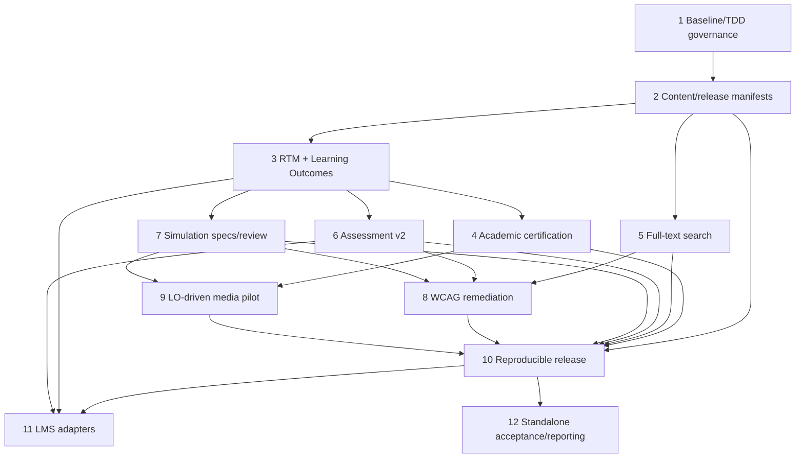

# Khắc phục sâu theo TDD để giáo trình điện tử sẵn sàng nghiệm thu và phát hành

## Hợp đồng đầu ra

### Outcome

Tạo một chuỗi build và nghiệm thu có thể lặp lại từ `CoHocLyThuyet_Full_New.docx` đến bản phát hành offline, trong đó mọi yêu cầu được truy vết tới chuẩn đầu ra, nội dung, câu hỏi, mô phỏng, bằng chứng và lệnh kiểm tra; các bề mặt search/quiz/simulation/PDF đạt tiêu chí chức năng và accessibility đã định; bản phát hành có version, manifest, checksum, provenance và notices; các gói LMS là adapter tách biệt, không làm sai lệch runtime standalone.

### Constraints

- DOCX là nguồn nội dung chuẩn; không sửa tay `chapters/**`, `images/**`, `js/pages.js`, `tools/docx_site_manifest.json` hoặc báo cáo generated.
- Runtime chuẩn phải chạy offline bằng `file://`, giữ kiến trúc HTML/CSS/JavaScript/Python hiện có; không thêm framework runtime.
- TDD bắt buộc: mỗi giai đoạn có RED chứng minh khoảng trống, GREEN tối thiểu, refactor và regression gate.
- Automation chỉ xác nhận cấu trúc, tính tái lập và bằng chứng; không tự tuyên bố đúng học thuật, hợp pháp hoặc đạt WCAG AA.
- Không giả lập chữ ký, người phê duyệt, kết quả SME, audit thủ công, target LMS hoặc môi trường Microsoft Word.
- Không lặp việc sửa runtime Sim2/Sim3 đã thuộc `plans/260713-1524-fix-all-sim2-sim3-defects-deep-tdd/`.

### Non-goals

- Không viết thêm chương/mục chuyên môn ngoài nội dung đã được review và xác nhận trong baseline áp dụng.
- Không chuyển sang SPA/framework/bundler mới.
- Không đưa telemetry hoặc LMS shim vào bản standalone mặc định.
- Không sản xuất video/audio đại trà khi chưa có LO gap đã được review và ghi nhận.
- Không sửa các release lịch sử `20260701`, `20260812`, `20260816`.

### Acceptance criteria

- `npm run test:equations` không còn phụ thuộc baseline lịch sử 117 HTML/127 ảnh; parity lấy từ manifest nguồn và trạng thái hiện hành.
- 100% requirement nối được tới LO, content và evidence với status rõ; requirement `confirmed` có đầy đủ coverage, còn `provisional` chỉ dùng cho nghiệm thu kỹ thuật và không hỗ trợ formal acceptance claim.
- Manifest cấu trúc, curated evidence và release package không chứa đường dẫn máy cục bộ; mọi join không mồ côi.
- Search tìm được nội dung thân bài tiếng Việt, có ranking/snippet/anchor, chạy `file://`, keyboard/screen-reader usable.
- Quiz có ID ổn định, metadata, deterministic attempt, migration/persistence và semantic controls.
- 25/25 Sim2 có Simulation Specification/evidence; 10/10 Sim3 có quyết định sư phạm; định nghĩa 4D không phóng đại hiện trạng.
- Evidence WCAG gồm automated + manual matrix; chỉ dùng ngôn ngữ conformance sau independent review phù hợp.
- One-command release chạy trong staging sạch, fail-fast, tạo `VERSION`, release manifest, `SHA256SUMS`, notices và smoke evidence.
- Adapter QTI/Common Cartridge/xAPI-cmi5/SCORM tách khỏi runtime chuẩn và có gate target-LMS tương ứng.
- Báo cáo nghiệm thu cuối không còn Critical/High/Medium kỹ thuật; review bên ngoài chưa có chỉ giới hạn đúng claim liên quan, không biến thành PASS giả hoặc blocker toàn bộ standalone.

## Scope challenge

- **Existing code:** DOCX pipeline, strict equation/image audit, 300 câu hỏi, 25 Sim2, 10 Sim3 pilot, PDF offline, 20 GIF và 205 Playwright tests đã tồn tại; kế hoạch tái sử dụng thay vì xây lại.
- **Requested scope:** xử lý đầy đủ 12 nhóm Todo và toàn bộ phát hiện trong `plans/reports/260820-0832-audit-todo-giao-trinh-dien-tu.md`.
- **Complexity:** 12 giai đoạn; phần lớn là contracts/build tools/tests; runtime thay đổi tập trung ở search, quiz và accessibility.
- **Selected mode:** HOLD + `--deep --tdd`; không cắt phạm vi, nhưng giữ các bước cần review bên ngoài ở trạng thái rõ ràng và không chặn kỹ thuật ngoài miền liên quan.

## Chẩn đoán đã xác nhận

1. Gate duy nhất đang đỏ là `npm run test:equations`: test Phase 01 còn khóa 117 HTML/127 ảnh, hiện trạng hợp lệ là 114/126 sau xóa route chủ ý.
2. `tools/docx_site_manifest.json` còn đường dẫn tuyệt đối và chưa mang route/version/hash đủ dùng cho release.
3. Search trong `js/app.js` chỉ tìm nhãn navigation; không có full-text, snippet, ranking hoặc anchor.
4. Quiz chỉ lưu tổng điểm `quizScores`; không có ID ổn định, LO/difficulty/type/source, attempt restore/history hoặc semantic option controls.
5. Kỹ thuật equation/image audit đã mạnh nhưng chưa có ledger/signoff độc lập gắn hash.
6. Chưa có RTM/LO baseline với review status rõ, 25 Simulation Specifications, 10 Sim3 pedagogical reviews, WCAG evidence package hoặc release manifest toàn gói.
7. Release docs đang drift giữa `20260812` và `20260816`; package hiện không có `VERSION`, `SHA256SUMS`, notices registry.
8. Chưa có LMS artifacts; QTI/CC/xAPI-cmi5/SCORM phải là adapter ngoài runtime chuẩn.

## Quyết định kiến trúc

### Chọn: generated structural manifests + curated evidence manifests + release orchestrator

- Generated: cấu trúc DOCX/routes/files/hashes; được build lại hoàn toàn.
- Curated: LO, RTM, academic review records, simulation specs, evidence; không bị extractor ghi đè.
- Release: đọc cả hai lớp, validate joins, chạy gates, đóng gói và phát sinh provenance/checksums.

Phương án một manifest duy nhất bị loại vì regenerate DOCX có thể ghi đè quyết định con người. Phương án docs-only bị loại vì không tạo được fail-fast gate và dễ lặp baseline stale.

### Chọn: search index tự xây tại build-time, zero runtime dependency

Repo nhỏ, offline-first, đã bundle content. Một index riêng có Vietnamese folding, field weights, snippets và stable anchors đơn giản hơn việc vendor MiniSearch/Lunr/FlexSearch và vẫn giữ `file://`.

### Chọn: quiz schema v2 tương thích v1

Normalize legacy data tại load-time, thêm stable ID/metadata/attempt state nhưng không xóa đường đọc v1 cho đến khi ba bank đã migrate và bundle parity pass.

### Chọn: standalone canonical, LMS derivative

QTI 3 trước; Common Cartridge sau; xAPI/cmi5 chỉ khi có LRS/privacy/launch contract; SCORM 2004 cuối cùng vì legacy và target-specific.

## Quan hệ với kế hoạch hiện có

| Plan | Quan hệ | Quy tắc |
|---|---|---|
| `260713-1524-fix-all-sim2-sim3-defects-deep-tdd` | Dependency cục bộ cho Phase 7/8/10/12 | Plan cũ sở hữu physics/clock/geometry/lifecycle/visual defects; plan này chỉ tiêu thụ gate và thêm spec/evidence/pedagogy. |
| `260820-0639-vit-li-phn-quy-cch-thnh-bo-co-np-chnh-thc` | Luồng biên tập song song | Phase 12 cung cấp evidence kỹ thuật và giới hạn để cập nhật báo cáo; không sửa DOCX báo cáo trước khi luồng đó hoàn tất inventory/baseline riêng. |
| `260522-0946-fix-duplicate-image-captions-docx-html-pipeline` | Lịch sử cần xác minh trạng thái | Phase 1 xác nhận contract hiện hành; không tái triển khai nếu zero duplicate và strict audit đã pass. |

## Luồng triển khai

## Phases

| # | Phase | Priority | Dependencies | Primary proof |
|---|---|---|---|---|
| 1 | [Khóa baseline nghiệm thu và quản trị TDD](./phase-01-start.md) | P0 | — | Reproduce stale gate; source-derived baseline RED/GREEN |
| 2 | [Xây manifest nội dung và phát hành chuẩn](./phase-02-build-canonical-content-and-release-manifests.md) | P0 | 1 | Deterministic parity/hash/portability tests |
| 3 | [Thiết lập RTM và chuẩn đầu ra](./phase-03-establish-traceability-and-learning-outcome-contracts.md) | P0 | 2 | Referential/coverage/status gates |
| 4 | [Chứng nhận công thức, hình và nội dung học thuật](./phase-04-certify-equations-images-and-academic-content.md) | P0 | 2, 3 | Hash-bound independent review records |
| 5 | [Cung cấp tìm kiếm toàn văn offline](./phase-05-deliver-full-text-offline-search.md) | P0 | 2 | `file://` full-text browser tests |
| 6 | [Nâng cấp đánh giá và lưu tiến trình](./phase-06-enrich-assessment-and-attempt-persistence.md) | P0 | 3 | Schema migration + deterministic attempt tests |
| 7 | [Ổn định bằng chứng mô phỏng và review sư phạm](./phase-07-stabilize-simulation-evidence-and-pedagogical-review.md) | P0 | 3 + sim defect plan | 25 specs + 10 reviews + drift gate |
| 8 | [Khắc phục bề mặt WCAG 2.2 AA](./phase-08-remediate-wcag-22-aa-surfaces.md) | P0 | 5, 6, 7 | Axe/keyboard/manual evidence matrix |
| 9 | [Thí điểm đa phương tiện theo chuẩn đầu ra](./phase-09-implement-learning-outcome-driven-multimedia-pilot.md) | P1 | 3, 4, 7 | LO gap decision + 3-5 complete assets or recorded no-go |
| 10 | [Xây pipeline release standalone tái lập](./phase-10-build-reproducible-standalone-release-pipeline.md) | P0 | 2, 4-9 | Clean one-command package + hashes + smoke |
| 11 | [Thêm adapter LMS theo tầng](./phase-11-add-staged-lms-interoperability-adapters.md) | P2 | 3, 6, 10 | QTI/CC validation; target-gated xAPI/cmi5/SCORM |
| 12 | [Hoàn tất bằng chứng nghiệm thu standalone và báo cáo](./phase-12-complete-acceptance-evidence-and-reporting.md) | P0 | 4-10 | Independent standalone acceptance report and Word/release evidence |

## Global TDD policy

Mỗi phase thực hiện: **RED → xác nhận failure đúng nguyên nhân → GREEN tối thiểu → refactor → scoped gate → full relevant regression**. Test mới phải bảo vệ observable contract; không test source text nếu behavior có thể chạy. Generated files chỉ đổi bằng generator. Screenshot/baseline chỉ cập nhật sau human triage và có evidence hash.

## Global quality gates

- Syntax: `node --check`/`python -m compileall` trên file thay đổi.
- Content: `npm run test:content`, `npm run test:equations`, `npm run test:audit:strict`.
- Quiz/search/app: focused Node + Playwright suites.
- Simulation: gates từ plan `260713-1524`; không dùng self-reported metrics làm oracle duy nhất.
- PDF: `npm run test:pdf:release`.
- Release: clean staging build, file:// and HTTP smoke, no external requests, ship-list exact, checksum validation.
- Evidence: every PASS row has command/artifact/hash/reviewer where applicable.

## Risk assessment

| Risk | First failure | Mitigation |
|---|---|---|
| Manifest drift | PAGE_MAP/PAGES/chapter tree mismatch | Single structural builder + parity validator; no hard-coded historical totals. |
| False academic certification | Technical audit interpreted as SME review | Separate ledger/review record and explicit non-claiming verifier output. |
| Search index stale/XSS | Wrong hit/unsafe snippet | Content hash/version join, escaped snippet renderer, nav-only visible fallback. |
| Quiz migration data loss | Corrupt/legacy localStorage | Versioned namespace, tolerant parser, bounded history, deterministic fixtures. |
| Sim plan duplication | Conflicting runtime edits | Cross-plan owner table and Phase 7 precondition. |
| Accessibility overclaim | Axe pass called WCAG AA | Manual checklist + independent reviewer + truthful conformance language. |
| Media scope creep | Production expands beyond LO gaps | 3-5 pilot cap; go/no-go after recorded LO-gap review. |
| Release non-reproducible | Different artifacts for same inputs | Clean staging, normalized timestamps/paths, manifest/checksum comparison. |
| LMS lock-in | Canonical runtime imports vendor API | Static boundary tests; adapters consume canonical JSON only. |
| External approval unavailable | Formal claim lacks authority evidence | Close technical/standalone evidence normally; mark only the affected formal claim as pending, with role/unit sufficient unless the institution requires named signoff. |

## Final success criteria

- [ ] Mọi phase kỹ thuật có thể thực hiện đã pass; stage LMS target-specific chưa đủ đầu vào được ghi `not-executed` cùng role/unit theo dõi và không chặn release standalone.
- [ ] Zero unresolved Critical/High/Medium technical findings.
- [ ] Zero dangling manifest/RTM/evidence references.
- [ ] Standalone release is reproducible and verified offline on target browsers.
- [ ] Academic, legal, accessibility và Word claims khớp review evidence; vai trò/đơn vị là đủ trừ khi quy trình chính thức yêu cầu danh tính/chữ ký; LMS claims được đánh giá riêng theo từng derivative package/target.
- [ ] README/deployment/architecture/codebase/changelog/report versions point to the same final artifact.

## Thông tin ghi nhận khi thực hiện hoặc nghiệm thu

1. Vai trò/đơn vị review chuẩn đầu ra, nội dung học thuật, accessibility và nghiệm thu; chỉ ghi họ tên/chức vụ nếu quy trình của đơn vị yêu cầu.
2. Đề cương hoặc chương trình đào tạo chính thức mới nhất đang được áp dụng làm baseline; mã học phần/số quyết định/hash chỉ bổ sung khi có sẵn hoặc cần cho hồ sơ.
3. Môi trường Windows/Microsoft Word thực tế dùng để hoàn thiện hoặc nộp; version/build được ghi trong biên bản lúc chạy gate, không cần khóa trước trong kế hoạch.
4. Target LMS/LRS và version/plugin chỉ ghi khi triển khai package tích hợp tương ứng; thiếu target không chặn release standalone.
5. Căn cứ pháp lý lấy từ nguồn chính thức và ghi trạng thái review; biên bản pháp chế riêng chỉ bắt buộc khi quy trình nghiệm thu của đơn vị yêu cầu.

Thiếu các chi tiết trên không chặn Phase 1-10 hoặc nghiệm thu kỹ thuật standalone. Nó chỉ giới hạn tuyên bố chính thức của đúng miền đang thiếu bằng chứng; kế hoạch không yêu cầu điền trước dữ liệu chưa tồn tại.