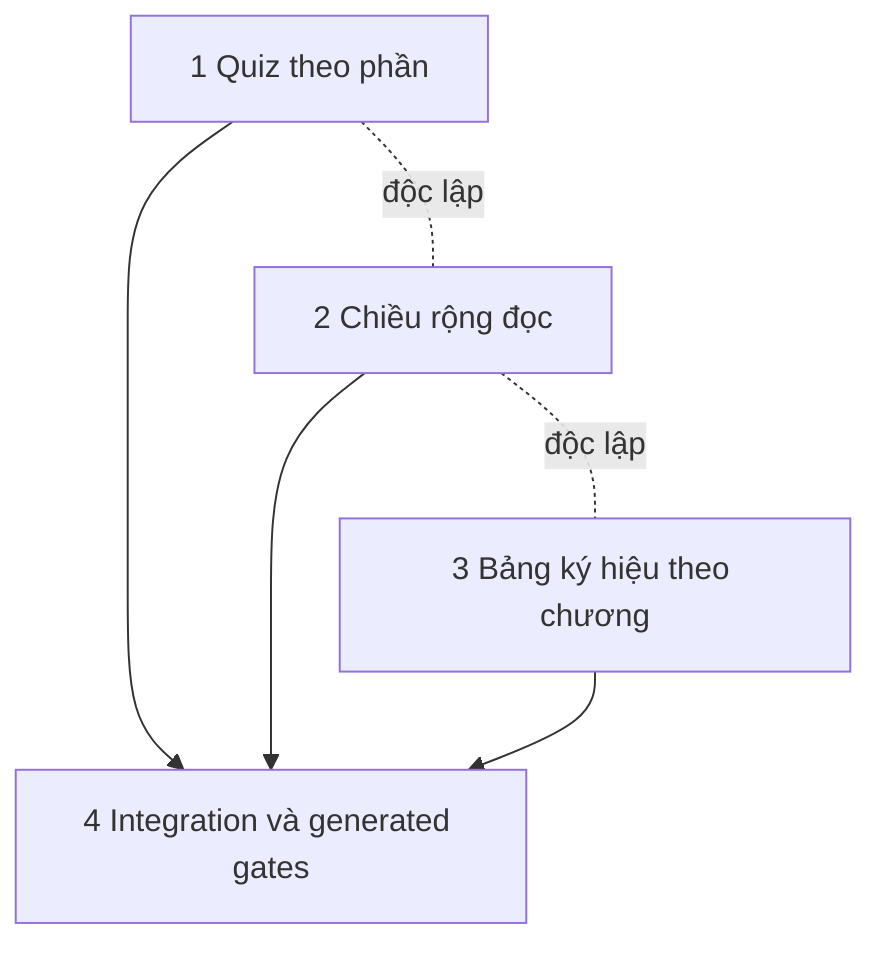

# Nâng cấp chiều rộng đọc, tra cứu ký hiệu và quiz theo phần

## Overview

Kế hoạch `--deep --tdd` hoàn thiện ba yêu cầu trên kiến trúc HTML/CSS/JS/Python chạy `file://`: người học chọn chiều rộng đọc; đầu mỗi chương có bảng ký hiệu/chữ viết tắt được sinh từ dữ liệu học thuật có truy vết; quiz cuối chương chọn được từng phần I–VII. Không thêm backend, framework, telemetry hoặc thay đổi simulation/PDF/LMS.

## Outcome Contract

- Mặc định giữ reading width hiện tại; nút hai trạng thái cho phép dùng toàn vùng `main` trừ gutter, lưu `contentWidth=standard|wide`.
- Trang đầu Chương 1–3 hiển thị bảng tra cứu sau phần giới thiệu và danh sách nội dung; text được escape, ký hiệu dùng KaTeX/MathML hiện có, liên kết nguồn điều hướng đúng route.
- Quiz có `<select>` phạm vi Toàn chương/I–VII, số câu động, Random lấy `min(10, scopedCount)`, lưu riêng attempt và phạm vi đã chọn.
- Mọi generated output chỉ thay qua generator; DOCX vẫn là narrative canonical, `data/chapter-reference.json` là curated supplemental academic input có hash provenance.
- Mỗi phase đi theo RED → GREEN → refactor → regression gate; automation không tuyên bố đúng học thuật hoặc final institutional acceptance.

## Scope Challenge

- **Existing:** section filtering/attempt keys đã có; quiz banks đã có `section`; BC/PAGE_ORDER đã sinh từ chapter tree; shell đã có pattern preference; extractor đã sở hữu chapter index.
- **Requested:** đúng ba cải tiến nêu trên.
- **Complexity:** 4 phase vì ba feature độc lập cần một integration/freshness gate; không thêm service/class.
- **Selected:** HOLD. Không mở rộng sang glossary redesign, auto-extract ký hiệu, browser fullscreen, quiz analytics hoặc release candidate mới.

## Architecture Decisions

1. **Width:** module nhỏ `js/content-width.js` chạy trong `<head>` trước CSS để áp dụng dataset trước first paint, rồi bind control khi DOM sẵn sàng. Không làm `js/app.js` 418 dòng lớn thêm; control giữ dạng icon qua tablet và chỉ ẩn ở narrow breakpoint không còn lợi ích chiều rộng.
2. **Quiz:** `tools/update_nav.py` sinh `window.CHAPTER_SECTIONS` từ cùng source với BC; `js/quiz.js` dựng native select và tính count từ bank; store v2 thêm `selectedSections` tương thích ngược. Preference scope là last-writer-wins giữa tab, còn attempts/answers vẫn giữ theo key riêng.
3. **Reference:** dữ liệu JSON curated, không raw HTML; helper Python thuần validate/render, extractor chèn sau `.ov-sec`; content-manifest schema v1 nhận provenance property bổ sung, builder hiện hành luôn emit và validator/freshness gate bắt buộc kiểm hash.
4. **Generated pages:** sửa `tools/gen_quiz_pages.py` thành CLI/import-safe, ghi đúng `trac-nghiem.html`, xóa output quiz cũ sau khi canonical write thành công.
5. **Review boundary:** schema/route/hash/render/freshness kiểm tự động; completeness/meaning của ký hiệu cần SME và tiếp tục dùng academic ledger hiện hành.

## Dependency Flow

## Cross-Plan Dependencies

Không có blocking edge. Plan release-readiness `260820-0924` có status stale so với source đã triển khai; plan duplicate-caption sở hữu post-processor khác; plan báo cáo Option B sửa DOCX khác. Phối hợp chỉ ở lần regenerate cuối, không sửa frontmatter các plan cũ.

## Phases

| # | Phase | Status | Priority | Dependencies | Primary proof |
|---|---|---|---|---|---|
| 1 | [Menu quiz theo từng phần](./phase-01-section-scoped-quiz-menu.md) | Completed | P1 | — | Unit store/catalog + file:// browser/persistence/keyboard |
| 2 | [Chế độ chiều rộng đọc](./phase-02-full-width-reading-mode.md) | Completed | P1 | — | Preference/reload/sidebar/reflow browser contracts |
| 3 | [Dữ liệu và render bảng ký hiệu](./phase-03-chapter-reference-data-rendering.md) | Completed | P1 | — | Schema/routes/escaping/deterministic extractor tests |
| 4 | [Đồng bộ artifacts và release gates](./phase-04-integration-generated-artifacts-release-gates.md) | Completed | P1 | 1, 2, 3 | Fresh build + content/search/quiz/a11y/release gates |

## Verification Strategy

- Phase-local gates chạy trước; không dùng full-suite để che lỗi cụ thể.
- Phase 4 chạy pipeline canonical: quiz pages → DOCX extract → nav → bundle → content manifest/validate → search index → audit.
- File:// là môi trường browser bắt buộc. Kiểm 320/560/640/768/800/1440/1920 px, sidebar mở/đóng, 200%/400% equivalent reflow.
- Không cập nhật visual snapshot threshold, không sửa generated file bằng tay, không đánh dấu academic acceptance nếu chưa có reviewer độc lập.

## Success Criteria

- [X] Ba yêu cầu hoạt động end-to-end trên `file://` và static HTTP.
- [X] Default layout không đổi; wide mode persist, accessible, không tạo page overflow.
- [X] 21 section-specific quiz options (+ 3 Toàn chương) khớp 21 section; count và attempt không rò giữa phạm vi.
- [X] Ba chapter index có reference table semantic, responsive, route-valid, hash-bound; không raw HTML.
- [X] Generator không còn tạo quiz page sai tên; bundle/manifest/search không stale.
- [X] Targeted unit/browser/a11y/content/search/release gates pass; external academic acceptance vẫn được báo đúng trạng thái.

## Reports

- [Codebase evidence and recommendations](./reports/codebase-evidence-and-recommendations.md)
- [Red-team review](./reports/red-team-review.md)
- [Critical plan validation](./reports/validation-report.md)

## Red Team Review

### Session — 2026-08-28

- Findings: 6 (5 accepted, 1 rejected); 0 Critical, 4 High, 2 Medium.
- Applied: explicit `window.CHAPTER_SECTIONS`; pre-CSS width bootstrap; tablet-operable width control; additive schema-v1 provenance; cross-tab scope/attempt contract.
- Rejected: deleting unrelated `cau-hoi-on-tap.html`.
- Reviewer agents: unavailable because configured API key was disabled; controller fallback evidence and exact dispositions are in [red-team-review.md](./reports/red-team-review.md).

### Whole-Plan Consistency Sweep

- Files reread: `plan.md`, Phases 1–4.
- Decision deltas checked: 5.
- Reconciled stale references: 13.
- Unresolved contradictions: 0.

## Validation Log

### Session 1 — 2026-08-28

**Trigger:** Mandatory `--deep --tdd` post-red-team validation.  
**Questions asked:** 4.

#### Confirmed Decisions

- Standard mặc định; Rộng dùng true available main width với gutter khi người học bật.
- `data/chapter-reference.json` là supplemental curated source có provenance; DOCX vẫn narrative canonical.
- Quiz bao gồm I–VII, ghi nhớ scope theo chương, attempt theo key riêng.
- Technical completion được phép với academic acceptance pending; không overclaim.

#### Verification Results

- Tier: Standard.
- Existing file claims: 30 checked, 30 verified, 0 failed, 0 unverified.
- `[UNVERIFIED]` tags: 0.
- Full answers and rationale: [validation-report.md](./reports/validation-report.md).

#### Impact on Phases

- Phases 1–4 đã khớp cả bốn quyết định; không cần đổi scope/dependency.
- Giữ toàn bộ red-team corrections đã áp dụng.

#### Whole-Plan Consistency Sweep

- Files reread: `plan.md`, Phases 1–4, linked research/red-team/validation reports.
- Decision deltas checked: 9 (5 red-team corrections + 4 validation confirmations).
- Reconciled after final reread: width first-paint/tablet breakpoints, explicit window catalog, scoped cross-tab semantics, schema-v1 provenance, phase-3 green gate, breakpoint/scope-count summary and linked report drift.
- Stale rejected terms found in canonical plan/phase files: 0.
- Unresolved contradictions: 0.

## Open Questions

None. Defaults đã khóa: true available-width với gutter; gồm Section VII; curated JSON + existing academic review boundary.

<!-- slug: reader-width-reference-section-quiz -->